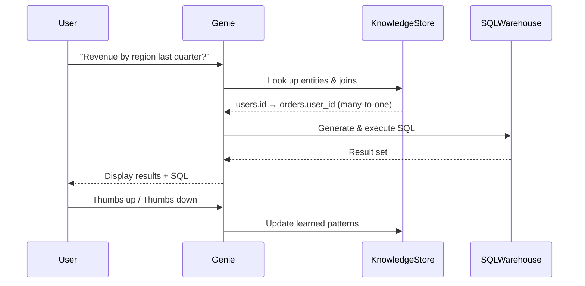

# Learning Path 1: Set Up and Configure the Azure Databricks Environment

**Exam Weight:** ~15-20% | **Modules:** 5 | **Labs:** 01, 02, 03

---

## What This Learning Path Covers

This learning path is your foundation. You'll learn what Azure Databricks is, how its architecture works, how to provision and configure compute resources, how to integrate with other Azure services, and how to set up Unity Catalog — the central governance layer. Mastering this path is essential because every subsequent concept builds on it.

---

## Module 1.1: Explore Azure Databricks

### Learning Objectives
- Provision an Azure Databricks workspace
- Identify core workloads for Azure Databricks
- Use Data Governance tools (Unity Catalog, Microsoft Purview)
- Describe key concepts of an Azure Databricks solution

### What is Azure Databricks?

Azure Databricks is a **first-party Microsoft Azure service** that provides a unified analytics platform built on top of **Apache Spark**. Think of it as "Spark-as-a-Service" with Azure integration baked in — identity (Microsoft Entra ID), storage (ADLS Gen2), and governance (Purview) all work out of the box.

The core promise of Azure Databricks is the **Lakehouse Architecture**:

```
┌──────────────────────────────────────────────┐
│              Consumption Layer               │
│   BI (Power BI)  │  ML  │  SQL Analytics     │
├──────────────────────────────────────────────┤
│              Lakehouse Platform              │
│   Unity Catalog  │  Delta Lake  │  Compute   │
├──────────────────────────────────────────────┤
│              Cloud Storage (ADLS)            │
│   Bronze (raw)  │  Silver (clean)  │  Gold   │
└──────────────────────────────────────────────┘
```

**Key insight for the exam:** The lakehouse combines *data lake flexibility* (store any format, cheap storage) with *data warehouse reliability* (ACID transactions, schema enforcement, governance). This is the fundamental architectural pattern you need to understand.

### Core Workloads

Azure Databricks supports four main workload categories:

| Workload | Description | Example Use Case |
|----------|-------------|------------------|
| **ETL/ELT** | Extract, transform, load data pipelines | Ingesting CSV files from ADLS, cleaning, and loading into Delta tables |
| **Data Science / ML** | Training and deploying models | Customer churn prediction using Spark ML |
| **Streaming Analytics** | Real-time data processing | IoT sensor data from Event Hubs |
| **SQL Analytics** | BI-style queries on lakehouse data | Sales dashboards via Databricks SQL Warehouses |

### Key Terminology for the Exam

- **Workspace:** Your environment in Azure Databricks — contains notebooks, jobs, compute, and data assets
- **Unity Catalog:** The central governance solution for managing data permissions, lineage, and discovery across workspaces
- **Delta Lake:** The open-source storage layer that provides ACID transactions, time travel, and schema enforcement on top of cloud storage
- **Metastore:** The top-level container in Unity Catalog that holds all metadata (one per region per account)
- **Serverless Compute:** Compute fully managed by Databricks — no VMs in your Azure subscription, instant start

### How to Provision a Workspace

Workspaces are created through the Azure Portal (or ARM templates, Terraform, Bicep):

1. In Azure Portal, search for "Azure Databricks" → **Create**
2. Choose:
   - **Pricing Tier:** Premium (required for Unity Catalog, Delta Live Tables, serverless)
   - **Workspace Name:** Globally unique? No — just unique within your resource group
   - **Region:** Choose based on data residency requirements
3. After creation, navigate to the workspace URL (e.g., `https://adb-123456789.10.azuredatabricks.net`)

> **💡 Exam Tip:** Know that **Premium tier** is required for Unity Catalog, serverless compute, and Delta Live Tables (Lakeflow Pipelines). The Standard tier doesn't support these.

---

## Module 1.2: Understand Azure Databricks Architecture

### Learning Objectives
- Describe the Azure Databricks account hierarchy
- Explain the difference between **control plane** and **compute plane**
- Understand workspace storage, external locations, and managed storage

### Account Hierarchy

```
Microsoft Entra ID
│
└── Azure Databricks Account
    ├── Account Console (account-level settings, billing)
    ├── Workspace 1 (dev)
    │   ├── Users / Groups / Service Principals
    │   ├── Notebooks / Dashboards
    │   ├── Compute (clusters, SQL warehouses)
    │   └── Unity Catalog objects
    ├── Workspace 2 (prod)
    └── ...
```

### Control Plane vs. Compute Plane

This is **critical for the exam**. Understand the separation:

| Aspect | Control Plane | Compute Plane (Classic) | Compute Plane (Serverless) |
|--------|--------------|------------------------|----------------------------|
| **Managed by** | Microsoft/Databricks | Customer's Azure subscription | Databricks |
| **What runs here** | Web app, REST APIs, job scheduler, cluster manager, notebook UI | Spark VMs, cluster nodes | Fully managed by Databricks |
| **Where it lives** | In Databricks' Azure subscription | In customer's subscription | In Databricks' subscription |
| **Network boundary** | Always separate | Can be VNet-injected | Databricks-managed |
| **Cost** | Included in DBU price | VM costs + DBUs | Premium DBU price |

**Why this matters:** The control plane never accesses your data directly. All data processing happens in the compute plane. This is a security boundary — the control plane orchestrates, the compute plane executes.

### Workspace Storage

Each workspace has a **root bucket/container** (ADLS Gen2 or AWS S3) that stores:
- Notebooks and their versions
- Cluster logs
- System data

In **serverless workspaces**, this storage is managed automatically by Databricks (you don't need to provide a storage account).

### External Locations

An **external location** is a connection between Unity Catalog and cloud storage (ADLS Gen2, S3, GCS). It consists of:
- A **URL** pointing to the storage container/folder
- A **storage credential** (service principal, access key, or IAM role) used for authentication

```sql
-- Register an external location
CREATE EXTERNAL LOCATION my_adls_location
  URL 'abfss://container@storageaccount.dfs.core.windows/data/'
  WITH (STORAGE CREDENTIAL my_credential);
```

### Managed Storage

When you create a Unity Catalog metastore, you specify a **managed storage location** — this is where Unity Catalog stores data for managed tables. Each catalog and schema can optionally override this with its own managed storage location.

**Three-level namespace:** Every object in Unity Catalog is addressed as `catalog.schema.object`.

> **💡 Exam Tip:** Know the difference between managed storage (UC controls data files) and external locations (user controls data files via external tables). This is a frequently tested concept.

---

## Module 1.3: Understand Azure Databricks Integrations

### Learning Objectives
- Understand integration with Microsoft Fabric, Power BI, VS Code, Power Platform, Copilot Studio, Purview, and Microsoft Foundry

### Key Integration Points

This module is about how Azure Databricks connects with the rest of the Microsoft ecosystem:

| Integration | What It Does | Exam Angle |
|-------------|-------------|------------|
| **Microsoft Fabric** | OneLake shortcuts to Databricks tables; mirroring of OneLake data in UC | Know bidirectional — Databricks can read Fabric data, Fabric can read Databricks data |
| **Power BI** | DirectQuery and Import modes connecting to Databricks SQL Warehouses | Know how to set up the connector |
| **VS Code Extension** | Local development with remote execution against Databricks clusters | Code locally, run on cluster |
| **Power Platform** | Connectors for Power Apps and Power Automate | No-code integration |
| **Copilot Studio** | AI agents query Databricks Genie spaces | Natural language to SQL |
| **Microsoft Purview** | Catalog and lineage capture for Databricks assets | Enterprise governance |
| **Microsoft Foundry** | Unified AI platform connecting to Databricks Genie spaces | AI/BI integration |

### VS Code Extension in Depth

The Databricks extension for VS Code lets you:
1. Clone repos via Git folders
2. Write code locally with IntelliSense
3. Run/debug code on a remote Databricks cluster
4. Browse Unity Catalog objects without leaving VS Code

This is the recommended workflow for production development — you get local IDE features with remote execution power.

---

## Module 1.4: Select and Configure Compute in Azure Databricks

### Learning Objectives
- Choose appropriate compute types for different workloads
- Configure compute performance settings
- Enable Photon acceleration, choose Databricks Runtime versions
- Configure compute access permissions
- Install and manage libraries

### Compute Types

Azure Databricks offers several compute types, and choosing the right one is a common exam scenario:

```
Compute Types
│
├── All-Purpose Clusters (interactive analysis, ad-hoc queries)
│   ├── Single User (fastest startup, your code only)
│   ├── Single User Dedicated (isolated)
│   └── No Isolation Shared (multiple users, slower startup)
│
├── Job Clusters (automated pipelines, created per-run)
│   ├── Automated (created and terminated by job scheduler)
│   └── Existing (reuse an all-purpose cluster)
│
├── SQL Warehouses (BI/SQL analytics)
│   ├── Serverless (instant, fully managed)
│   ├── Classic (VMs in your subscription)
│   └── Pro (faster auto-scaling)
│
└── Lakeflow Pipeline Compute (for DLT pipelines)
    ├── Enhanced (serverless for DLT)
    └── Classic (customer VMs)
```

### When to Use Each Type

| Workload | Recommended Compute | Reason |
|----------|-------------------|--------|
| Ad-hoc data exploration | All-Purpose Cluster (Serverless) | Fast start, no management |
| Scheduled ETL job | Job Cluster | Auto-terminates, cost-efficient |
| BI dashboard queries | SQL Warehouse (Serverless) | Optimized for SQL, instant |
| DLT pipeline | Lakeflow Pipeline Compute | Auto-orchestrated, exactly-once |
| ML training | All-Purpose Cluster (ML Runtime) | Pre-installed ML libraries |

### Photon Acceleration

**Photon** is Databricks' native vectorized query engine that runs SQL and DataFrame operations up to **10x faster** than standard Spark JVM execution.

```sql
-- Photon is enabled at the cluster level
-- In cluster config: Enable Photon = true
-- It works transparently — no code changes needed
```

**When Photon helps most:** SELECT, aggregation, JOIN, filter operations on Delta tables. It's automatically used by SQL Warehouses and can be enabled on all-purpose clusters.

**When Photon doesn't help:** Python UDFs (non-vectorized operations), ML training.

### Databricks Runtime Versions

| Runtime | Best For |
|---------|----------|
| **LTS (Long-Term Support)** | Production workloads — stable, 2 years of support |
| **Non-LTS** | Latest features, shorter support window |
| **ML Runtime** | ML workloads — pre-installed TensorFlow, PyTorch, scikit-learn |
| **Serverless** | Fully managed runtime — no version selection |

### Autoscaling and Auto-Termination

**Autoscaling:** The cluster dynamically adjusts worker count between `min_workers` and `max_workers` based on workload. This is *elastic* autoscaling in recent runtimes — it can scale down more aggressively than the classic version.

```python
# Cluster config example (via API)
{
  "autoscale": {
    "min_workers": 2,
    "max_workers": 8
  },
  "autotermination_minutes": 30  # Auto-terminate after 30 min idle
}
```

**Auto-termination:** Critical for cost control. Clusters auto-terminate after a configurable idle period (default: 30 minutes on interactive clusters; job clusters auto-terminate when the job finishes).

**Access Modes:**
- **Single User:** Fastest startup, one user (or service principal)
- **Single User (dedicated):** Isolated cluster for one user
- **No Isolation Shared:** Multiple users share the cluster — starts slower (needs to set up proxy)

### Compute Permissions

Access to compute resources is governed by a granular permission model. Understanding the different permission levels is important for both the exam and real-world administration.

#### Cluster Permissions

| Permission Level | Capabilities |
|-----------------|--------------|
| **Can Attach To** | User can attach notebooks and jobs to the cluster |
| **Can Restart** | User can start, stop, and restart the cluster |
| **Can Manage** | Full control — modify configuration, change permissions, delete the cluster |

#### SQL Warehouse Permissions

| Permission Level | Capabilities |
|-----------------|--------------|
| **Can Use** | User can run queries on the SQL warehouse |
| **Can Monitor** | User can view query history and monitoring dashboards |
| **Can Manage** | Full control — modify configuration, change permissions, manage the warehouse |

#### Pool Permissions

| Permission Level | Capabilities |
|-----------------|--------------|
| **Can Attach To** | User can attach clusters to the pool |
| **Can Manage** | Full control over the pool configuration |

> **💡 Exam Tip:** Know the difference between "Can Attach To" and "Can Restart" for clusters. A user with "Can Attach To" can use a cluster but cannot modify its configuration or restart it. Only "Can Manage" gives full control.

### Instance Pools

An **instance pool** is a set of idle, ready-to-use cloud instances that reduces cluster startup time. Pools sit between your subscription's VMs and Databricks clusters, providing a warm pool of pre-initialized instances.

#### When to Use Pools

- **Fast startup needed:** Clusters using a pool start faster because instances are already provisioned
- **Cost management:** You can manage costs by setting minimum and maximum idle instances
- **Hybrid scenarios:** Mix pool instances with on-demand instances for burst capacity

#### Pool vs. Serverless

| Aspect | Instance Pool | Serverless Compute |
|--------|--------------|-------------------|
| **Startup time** | Fast (seconds, not minutes) | Instant |
| **Management overhead** | You manage pool sizing | Fully managed by Databricks |
| **VM visibility** | VMs in your Azure subscription | No VMs visible |
| **Cost model** | VM costs + DBUs | Premium DBU price only |
| **When to choose** | You want faster startup but control VM config | You want zero management |

#### Pool Configuration

```json
{
  "instance_pool_id": "pool-123456789",
  "min_idle_instances": 5,
  "max_capacity": 50,
  "node_type_id": "Standard_DS3_v2",
  "idle_instance_autotermination_minutes": 15
}
```

- **min_idle_instances:** Minimum number of instances kept warm — set based on expected concurrent usage
- **max_capacity:** Hard limit on total instances in the pool
- **idle_instance_autotermination_minutes:** How long an idle instance stays in the pool before being released (cost control)

> **💡 Exam Tip:** Pools are about reducing startup latency for classic compute. Serverless compute makes pools largely unnecessary in serverless workspaces because startup is already instant. Know which scenario calls for each.

### Library Management

There are four levels of library installation:

1. **Cluster-scoped libraries:** Installed on all nodes of the cluster via the UI or API
   ```python
   # Via cluster config API
   "libraries": [{"pypi": {"package": "faker"}}]
   ```

2. **Notebook-scoped libraries:** Installed only for the current notebook session
   ```python
   %pip install faker
   %conda install -c conda-forge faker
   ```

3. **Init scripts:** Shell scripts that run on cluster node startup — install system packages, configure environment

4. **Workspace-scoped libraries:** Libraries uploaded to the workspace and available to all clusters

> **💡 Exam Tip:** Know when to use each library type. Notebook-scoped (`%pip`) is best for ad-hoc exploration. Cluster-scoped is for production clusters where you need libraries every time.

### 🔬 Lab 02 Reference: Select and Configure Compute

**Scenario:** HealthBridge Analytics (healthcare)
**Duration:** 30 minutes

In this lab, you practice:
1. **Creating an all-purpose cluster** — choosing runtime version, enabling Photon, setting autoscaling (2-8 workers), 30-min auto-termination
2. **Installing cluster-scoped libraries** — adding the `faker` library via PyPI
3. **Installing notebook-scoped libraries** — using `%pip install faker` inside a notebook
4. **Generating synthetic patient data** — using PySpark + faker to create realistic healthcare datasets

**Key Skills Practiced:**
- Configuring cluster performance settings
- Understanding the difference between cluster-scoped and notebook-scoped libraries
- Working with the Databricks compute UI

```python
# From the lab: Installing faker at notebook scope
%pip install faker

# Generating synthetic data
from faker import Faker
fake = Faker()

# Create patient records using PySpark
from pyspark.sql.types import StructType, StructField, StringType, IntegerType, DateType

data = [(fake.first_name(), fake.last_name(), fake.date_of_birth(), fake.ssn(), fake.phone_number()) 
        for _ in range(1000)]

schema = StructType([
    StructField("first_name", StringType(), True),
    StructField("last_name", StringType(), True),
    StructField("date_of_birth", DateType(), True),
    StructField("ssn", StringType(), True),
    StructField("phone", StringType(), True)
])

patients_df = spark.createDataFrame(data, schema)
patients_df.write.mode("overwrite").saveAsTable("health_bridge.bronze.patients")
```

---

## Module 1.5: Create and Organize Objects in Unity Catalog

### Learning Objectives
- Apply naming conventions for Unity Catalog objects
- Create catalogs, schemas, managed/external tables, views, and volumes
- Implement DDL operations including functions and stored procedures
- Implement foreign catalogs
- Configure AI/BI Genie instructions

### The Three-Level Namespace

Unity Catalog organizes data using a **three-level namespace**: `catalog.schema.object`

```
Metastore
└── Catalog (e.g., dev_catalog, prod_catalog)
    └── Schema (e.g., bronze, silver, gold)
        ├── Table (managed or external)
        ├── View (standard or materialized)
        ├── Volume (for unstructured files)
        ├── Function (reusable SQL UDF)
        ├── Model (AI/ML model)
        └── Foreign Catalog (link to external DB)
```

### Naming Conventions

Standard Unity Catalog naming conventions for the exam:

| Object | Convention | Example |
|--------|-----------|---------|
| Catalog | lowercase_with_underscores, descriptive | `finance_dev`, `hr_prod` |
| Schema | lowercase, medallion layers | `bronze`, `silver`, `gold` |
| Table | lowercase, descriptive, singular/plural | `customers`, `orders` |
| Volume | lowercase | `raw_files`, `landing_zone` |

### Creating Objects: SQL Reference

```sql
-- Create a catalog (top-level container)
CREATE CATALOG IF NOT EXISTS finance_dev;

-- Create schemas following medallion architecture
CREATE SCHEMA IF NOT EXISTS finance_dev.bronze;
CREATE SCHEMA IF NOT EXISTS finance_dev.silver;
CREATE SCHEMA IF NOT EXISTS finance_dev.gold;

-- Create a MANAGED table (data stored in UC managed storage)
CREATE OR REPLACE TABLE finance_dev.bronze.raw_transactions (
  transaction_id STRING NOT NULL,
  account_id STRING,
  amount DECIMAL(10,2),
  timestamp TIMESTAMP,
  description STRING
) USING DELTA;

-- Create an EXTERNAL table (data stored in user-managed cloud storage)
CREATE TABLE finance_dev.bronze.external_source
USING DELTA
LOCATION 'abfss://container@storage.dfs.core.windows.net/data/source/';

-- Create a standard view (virtual, no data storage)
CREATE VIEW finance_dev.silver.active_accounts AS
SELECT account_id, customer_id, account_type, balance
FROM finance_dev.silver.accounts
WHERE status = 'active';

-- Create a MATERIALIZED view (physical storage, auto-refreshes)
CREATE MATERIALIZED VIEW finance_dev.gold.daily_revenue AS
SELECT 
  DATE(timestamp) as business_date,
  SUM(amount) as total_revenue
FROM finance_dev.silver.transactions
GROUP BY DATE(timestamp);

-- Create a VOLUME (for unstructured files like CSV, JSON, images)
CREATE VOLUME finance_dev.bronze.raw_files;
```

### Managed vs. External Tables

| Aspect | Managed Table | External Table |
|--------|--------------|----------------|
| **Who controls metadata** | Unity Catalog | Unity Catalog |
| **Who controls data files** | Unity Catalog (managed storage) | User (external location) |
| **DROP TABLE behavior** | Files soft-deleted (8-day retention) | Files remain untouched |
| **Predictive optimization** | Available | Not available |
| **When to use** | Standard data warehouse tables | Data already in cloud storage |

> **💡 Exam Tip:** You'll get scenario questions asking which table type to use. If the scenario mentions "existing data in ADLS Gen2" or "want data to persist after DROP TABLE", choose **external**. If it's new data being loaded and managed by Databricks, choose **managed**.

### Volumes

Volumes are a **Unity Catalog object type for unstructured data**. They store files like CSV, JSON, images, and binaries. Think of volumes as "directories in Unity Catalog" where you can upload and access raw files.

```sql
-- Create a volume
CREATE VOLUME IF NOT EXISTS finance_dev.bronze.raw_files;

-- Reference files in a volume
-- Path pattern: /Volumes/<catalog>/<schema>/<volume>/<path>
df = spark.read.csv("/Volumes/finance_dev/bronze/raw_files/transactions.csv")

-- List files in a volume (in notebook)
display(dbutils.fs.ls("/Volumes/finance_dev/bronze/raw_files/"))
```

### Foreign Catalogs (Lakehouse Federation)

Foreign catalogs connect Unity Catalog to external database systems using **Lakehouse Federation**. This allows you to query data from external sources as if they were native Unity Catalog tables, **without moving the data**.

#### Supported Connection Types

Lakehouse Federation supports a wide range of external systems:

| Connection Type | Target System |
|----------------|---------------|
| `databricks` | Another Databricks workspace (Unity Catalog) |
| `mysql` | MySQL database |
| `postgresql` | PostgreSQL database |
| `sqlserver` | SQL Server / Azure SQL Database |
| `snowflake` | Snowflake data warehouse |
| `bigquery` | Google BigQuery |
| `sqlite` | SQLite database |
| `trino` | Trino / Presto |
| `oracle` | Oracle Database |

#### Creating Connections

A **connection** is a Unity Catalog object that stores the connection details and credentials for an external system. You then create a **foreign catalog** that uses that connection to expose the external database's schemas and tables.

```sql
-- Step 1: Create a connection to Azure SQL Database
CREATE CONNECTION sqlserver_conn
  TYPE sqlserver
  OPTIONS (
    host 'myserver.database.windows.net',
    port '1433',
    user 'service_account',
    password dbutils.secrets.get('scope', 'sql-password')
  );

-- Step 2: Create a foreign catalog using the connection
CREATE FOREIGN CATALOG sql_sales
  USING CONNECTION sqlserver_conn
  OPTIONS (database 'sales_db');
```

> **🔐 Security Note:** Always use **Databricks Secrets** (via `dbutils.secrets.get()`) for passwords and credentials — never hardcode them in SQL.

#### Querying Foreign Catalogs

Once the foreign catalog is created, you query it using the standard three-level namespace:

```sql
-- Query a table in the foreign catalog
SELECT * FROM sql_sales.dbo.orders
WHERE order_date >= '2024-01-01';

-- Join a foreign table with a native Delta table
SELECT c.customer_name, o.order_total
FROM sql_sales.dbo.customers c
JOIN finance_dev.silver.orders o
  ON c.customer_id = o.customer_id;
```

Each query executes in **real time** against the external system — nothing is copied into Delta Lake unless you explicitly choose to.

#### Performance Considerations

- Queries run on the **external system's engine** — make sure appropriate indexes exist there
- Network latency between Databricks and the external source affects query speed
- Use `CREATE OR REPLACE TABLE ... AS SELECT * FROM foreign_catalog...` to **materialize** data into Delta Lake for better performance
- Consider **pushdown optimizations**: filter and aggregation clauses are pushed to the source system when possible
- Foreign catalogs do **not** support Delta-specific features (time travel, Change Data Feed, predictive optimization) on the source tables

```sql
-- Materialize foreign data into a native Delta table for faster queries
CREATE OR REPLACE TABLE finance_dev.silver.orders_snapshot AS
SELECT * FROM sql_sales.dbo.orders;
```

> **💡 Exam Tip:** Lakehouse Federation is about **querying data in place** without migration. If a scenario mentions avoiding data duplication or integrating with existing databases, think foreign catalogs. If it mentions performance-sensitive dashboards, think about materializing to Delta.

#### Foreign Catalog Permissions

Just like native Unity Catalog objects, you can grant permissions on foreign catalogs:

```sql
GRANT USAGE ON FOREIGN CATALOG sql_sales TO analysts;
GRANT SELECT ON FOREIGN CATALOG sql_sales TO analysts;
```

### Table and Column Comments (COMMENT ON)

Adding descriptive comments to tables and columns is a best practice for documentation and discoverability. Comments can be set or removed using the `COMMENT ON` syntax:

```sql
-- Add a comment to a table
COMMENT ON TABLE finance_dev.silver.customers IS
  'Customer master data with account status and segment classification';

-- Add a comment to a column
COMMENT ON COLUMN finance_dev.silver.customers.email IS
  'Primary email address, verified on registration';

-- Add a comment to a view
COMMENT ON VIEW finance_dev.gold.daily_revenue IS
  'Daily revenue aggregated from silver.transactions, refreshed hourly';

-- Remove a comment (set to NULL)
COMMENT ON TABLE finance_dev.silver.customers IS NULL;
```

Comments are visible in:
- `DESCRIBE TABLE EXTENDED` output
- Unity Catalog Explorer UI
- AI/BI Genie (comments feed into Genie's understanding of the schema)

> **💡 Exam Tip:** Comments are especially relevant for Genie — well-described tables and columns help Genie generate more accurate SQL. This connects LP1 (comments) with LP2 (data documentation and discoverability).

### AI/BI Genie Instructions

**Genie** is a natural language interface for querying data. You can add **Genie instructions** — plain text descriptions of what each schema/table/column contains — to help Genie generate accurate SQL:

```sql
-- Add Genie instruction to a schema
ALTER SCHEMA finance_dev.silver SET TAG 'genie.description' = 
  'Cleansed and validated financial transaction data. Use this layer for analytics.';  

-- Add Genie instruction to a table
ALTER TABLE finance_dev.silver.customers SET TAG 'genie.description' = 
  'Customer master data with account status, segment, and contact info.';
```

### AI/BI Genie Deep Dive

#### Genie Spaces

A **Genie space** is a container scoped to a Unity Catalog schema that enables natural-language-to-SQL querying. It provides an interactive chat interface where users ask questions in plain English and Genie generates and executes the corresponding SQL.

**Key Characteristics:**
- Each Genie space is **bound to exactly one schema** in Unity Catalog
- Multiple Genie spaces can exist for different schemas or use cases
- Spaces persist — conversations, learned knowledge, and instructions are retained

**Creating a Genie Space via the UI:**
1. Navigate to the workspace UI → Click **Create** → **Genie Space**
2. Select the catalog and schema the space will query
3. Add initial instructions (natural language guidance for Genie's query generation)
4. Optionally restrict which tables/views within the schema are accessible

**Genie Spaces vs. SQL Warehouses:**

| Aspect | Genie Space | SQL Warehouse |
|--------|------------|--------------|
| **Interface** | Natural language chat | SQL editor / BI tool connector |
| **Compute** | Uses a SQL Warehouse under the hood | Dedicated compute resource |
| **User skill** | No SQL needed | Requires SQL knowledge |
| **Best for** | Business users, analysts | Data engineers, analysts who know SQL |
| **Persistence** | Conversation history, learned patterns | Query-by-query only |

> **💡 Exam Tip:** Genie Spaces are a **user-facing** feature. The exam tests whether you know Genie Spaces are scoped to a schema, and that they use SQL Warehouses as the compute backend — but the SQL Warehouse is transparent to the user.

#### Entity Matching

Entity matching is how Genie automatically discovers relationships between tables to understand how they join:

**How Genie Discovers Relationships:**
1. **Foreign key constraints** — Defined in Unity Catalog via `ALTER TABLE ... ADD CONSTRAINT FOREIGN KEY`, Genie uses these as ground-truth relationships
2. **Column name similarity** — Heuristic matching (e.g., `customer_id` in `orders` matches `id` in `customers`)
3. **Data profiling** — Genie samples data to detect joinable columns by comparing value distributions
4. **Unity Catalog tags and descriptions** — Well-documented tables and columns with `genie.description` tags improve matching accuracy

**When a user asks a question:**
1. Genie parses the question to identify entities (e.g., "revenue by customer" → revenue and customer entities)
2. Entity matching determines which tables and columns are relevant
3. Genie generates SQL using the matched entities, join paths from the knowledge store, and any instructions
4. The generated SQL and its **entity matching confidence score** is shown to the user

**Confidence Levels:**
- **High confidence:** Clear FK relationships or strong column name matches
- **Medium confidence:** Data profiling suggests match but no FK constraint
- **Low confidence:** Weak column similarity — Genie may ask the user to clarify

> **💡 Exam Tip:** Entity matching works best when you have proper FK constraints defined in Unity Catalog. On the exam, if a scenario mentions that Genie is not finding correct joins, the fix is likely to **define foreign key constraints** or **add knowledge to the knowledge store**.

#### Knowledge Store (Many-to-One Joins)

The **knowledge store** is where Genie stores learned table relationships, join paths, query patterns, and business terminology. It persists across Genie sessions and grows more accurate over time.

**What You Can Store in the Knowledge Store:**

- **Join paths between tables** — Explicitly define how tables relate to each other
- **Many-to-one relationship definitions** — E.g., `orders.customer_id` maps to `customers.id` (many orders can belong to one customer)
- **Business terminology** — E.g., "ARR" means "annual recurring revenue", defined as `SUM(revenue) WHERE recurring = true AND ...`
- **Common query patterns** — Pre-validated queries like "monthly revenue by region" that Genie can reuse

**Adding Knowledge:**

```sql
-- In the Genie space UI → Knowledge tab → Add a join
-- Source column: orders.customer_id
-- Target column: customers.id
-- Join type: Many-to-One (orders → customers)
```

**Knowledge Validation:**
- **Validated knowledge:** Reviewed and approved by the data team — Genie trusts it completely
- **Suggested knowledge:** Genie's self-learning from user interactions — may need review

```sql
-- Knowledge can also include metric definitions via tag instructions
ALTER TABLE finance_dev.silver.transactions SET TAG 'genie.description' = 
  'Transaction records. Net revenue = gross_amount - discounts - refunds.';
```

> **💡 Exam Tip:** The knowledge store is what makes Genie improve over time. A common exam scenario: "Genie is generating incorrect joins" → the answer is to add join knowledge to the knowledge store or define FK constraints.

#### Genie Instructions (Deep Dive)

Instructions are natural language guidance that shapes how Genie generates SQL. They can be applied at multiple levels:

**Instruction Levels:**

| Level | Scope | Example |
|-------|-------|---------|
| **Schema-level** | Describes the schema's purpose and conventions | "This schema contains cleansed financial data, updated nightly at 2 AM" |
| **Table-level** | Describes table contents, edge cases, date ranges | "The `orders` table contains only completed transactions; cancelled orders are in `orders_cancelled`" |
| **Column-level** | Describes units, formats, special values | "status = -1 means pending, status = 0 means active, status = 1 means completed" |
| **Metric definitions** | Defines computed metrics | "Net revenue = gross_revenue - discounts - refunds" |

**How to Add Instructions:**

```sql
-- Schema-level instruction (tag-based)
ALTER SCHEMA finance_dev.silver SET TAG 'genie.description' = 
  'Cleansed financial data. Use this layer for analytics and reporting.';

-- Table-level instruction (tag-based)
ALTER TABLE finance_dev.silver.customers SET TAG 'genie.description' = 
  'Customer master data with account status, segment classification, and contact information.';

-- Column-level instruction via COMMENT ON
COMMENT ON COLUMN finance_dev.silver.customers.status IS 
  'Customer status: 0=active, 1=inactive, -1=pending review';
```

**Instructions can also be added directly in the Genie space settings** (UI) — these are space-specific and do not require ALTER statements.

**Best Practices:**
- Be **specific and unambiguous** — avoid vague descriptions
- Include **examples** of good queries the space should support
- Define **business terms explicitly** (e.g., "churned = no purchase in 90+ days")
- Note **data quirks** (e.g., "field may contain NULL for legacy records", "data is updated nightly at 2 AM UTC")
- Use **consistent terminology** that matches how business users speak

#### Genie Settings

Genie spaces offer several configuration options:

- **Restrict to specific tables/views** — Limit which objects within the schema Genie can query
- **Enable/disable auto-entity matching** — Turn automatic relationship discovery on/off
- **Temperature setting** — Controls creativity in SQL generation (lower = more predictable, higher = more varied but risk of errors)
- **Schema selection** — Subset of tables within the bound schema that Genie should consider
- **Feedback collection** — Enable thumbs up/down on Genie responses to train the knowledge store

```json
{
  "space_name": "sales_analytics",
  "schema": "finance_dev.gold",
  "restricted_tables": ["finance_dev.gold.revenue_summary", "finance_dev.gold.customer_metrics"],
  "auto_entity_matching": true,
  "temperature": 0.2,
  "feedback_enabled": true
}
```

#### Genie Query Flow

1. **User asks a question** in natural language (e.g., "What was our revenue last quarter by region?")
2. **Entity matching** identifies relevant tables and columns
3. **Genie generates SQL** using matched entities + knowledge store join paths + instructions + schema metadata
4. **User reviews the SQL** — the generated SQL is displayed and can be edited before execution
5. **User executes** — the SQL runs against the underlying SQL Warehouse and results are displayed
6. **User provides feedback** — thumbs up/down, which updates the knowledge store
7. **Over time, Genie improves** — the knowledge store grows more accurate for that specific dataset



> **💡 Exam Tip:** The Genie query flow is not heavily tested on the exam, but understanding the **feedback loop** (user feedback → knowledge store → better queries) is important. Know that Genie uses a SQL Warehouse for execution, but users don't need to interact with it directly.

#### Genie Use Cases

| Use Case | Description | Example |
|----------|-------------|---------|
| **Self-service analytics** | Business users query data without SQL | Marketing team analyzing campaign performance |
| **Copilot Studio integration** | AI agents query Genie spaces | "Show me customer churn by segment" via Microsoft Copilot |
| **Embedded analytics** | Genie embedded in applications | Customer portal with natural language reporting |
| **Quick prototyping** | Analysts explore new datasets fast | "What are the top 10 products by revenue?" |
| **Microsoft Foundry integration** | Unified AI platform connects to Genie | AI/BI integration across the Microsoft ecosystem |

> **🔬 Lab Connection:** This Genie content connects to the AI/BI concepts you'll explore in later labs. While Lab 03 focuses on DDL operations, Genie builds on top of those well-described tables to provide natural language querying.

### 🔬 Lab 03 Reference: Create and Organize Objects in Unity Catalog

**Scenario:** Lakeside University (academic data platform)
**Duration:** 45 minutes

This lab is **critical** — it exercises almost every DDL operation you need for the exam:

**What You Build:**
```
edu_dev catalog
├── bronze schema
│   ├── students (managed table)
│   ├── courses (managed table) 
│   └── enrollments (managed table)
├── silver schema
│   ├── students (cleaned, with constraints)
│   ├── courses (with constraints)
│   ├── enrollments (with FK constraints)
│   └── vw_student_enrollments (standard view)
├── gold schema
│   └── vw_department_enrollment_stats (materialized view)
├── functions schema
│   └── classify_grade() (SQL UDF)
└── bronze.raw_files (volume)
```

**Key Code from the Lab:**

```sql
-- Create catalog and medallion schemas
CREATE CATALOG IF NOT EXISTS edu_dev;
CREATE SCHEMA IF NOT EXISTS edu_dev.bronze;
CREATE SCHEMA IF NOT EXISTS edu_dev.silver;
CREATE SCHEMA IF NOT EXISTS edu_dev.gold;

-- Create managed tables with constraints
CREATE OR REPLACE TABLE edu_dev.silver.students (
  student_id INT NOT NULL PRIMARY KEY,
  first_name STRING NOT NULL,
  last_name STRING NOT NULL,
  email STRING,
  date_of_birth DATE,
  enrollment_date DATE,
  department STRING
);

-- Add foreign key constraint
ALTER TABLE edu_dev.silver.enrollments
ADD CONSTRAINT fk_student_enrollment
  FOREIGN KEY (student_id) REFERENCES edu_dev.silver.students(student_id);

-- Create a reusable SQL scalar function
CREATE OR REPLACE FUNCTION edu_dev.functions.classify_grade(grade DECIMAL(3,1))
RETURNS STRING
RETURN CASE
  WHEN grade >= 8.5 THEN 'A'
  WHEN grade >= 7.0 THEN 'B'
  WHEN grade >= 5.5 THEN 'C'
  WHEN grade >= 4.0 THEN 'D'
  ELSE 'F'
  END;
```

---

## Learning Path 1: Key Exam Tips

### High-Priority Concepts

1. **Control Plane vs Compute Plane** — Know the separation, what runs where, and the security implications
2. **Compute Types** — When to use all-purpose vs job clusters vs SQL warehouses vs Lakeflow compute
3. **Photon** — What it accelerates (SQL/DataFrame), what it doesn't (Python UDFs)
4. **Managed vs External Tables** — Behavior differences, when to use each
5. **Three-level namespace** — `catalog.schema.object`
6. **Library Management** — notebook-scoped vs cluster-scoped vs init scripts
7. **Serverless Compute** — Benefits (instant start, no VMs to manage), cost model (premium DBUs)

### Common Scenario Questions

**Scenario:** "Your team needs to run a scheduled ETL job daily at 2 AM. What compute type should you use?"
→ **Job Cluster** (auto-creates and terminates, cost-efficient)

**Scenario:** "Data scientists need to explore data interactively with minimal startup time."
→ **All-Purpose Cluster** with Serverless (instant start)

**Scenario:** "You need to store raw CSV files in Unity Catalog for access by multiple notebooks."
→ **Create a Volume** (volumes store unstructured files)

**Scenario:** "You have existing data in ADLS Gen2 that other teams also access directly. You want to make it queryable in Databricks but not duplicate storage."
→ **External Table** with an External Location pointing to the ADLS container

### Commands to Memorize

```sql
CREATE CATALOG IF NOT EXISTS ...;
CREATE SCHEMA ...;
CREATE OR REPLACE TABLE ... USING DELTA;
CREATE VIEW ... AS SELECT ...;
CREATE MATERIALIZED VIEW ... AS SELECT ...;
CREATE VOLUME ...;
ALTER TABLE ... ADD CONSTRAINT ...;
GRANT ... ON ... TO ...;
SHOW GRANTS ON ...;
DESCRIBE ...;
DESCRIBE DETAIL ...;
```
---

**Next:** Move on to [Learning Path 2: Secure and Govern Unity Catalog](lp2-secure-and-govern-unity-catalog.md)
